# Tugas Database Perpustakaan

## 👤 Identitas
Nama: Zahra Zahrani  
NIM: 60324011

---

## Statistik Buku

### 1. Total Buku
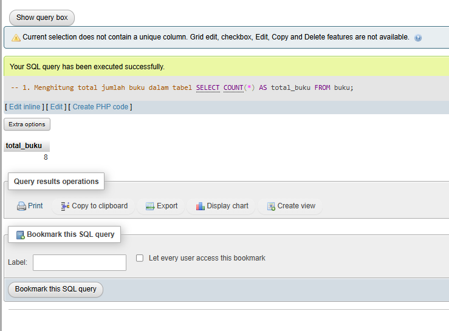

### 2. Total Nilai Inventaris
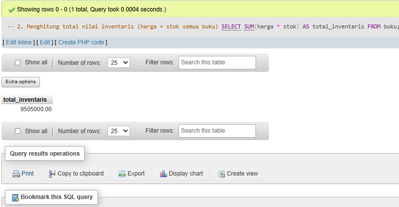

### 3. Rata-rata Harga Buku
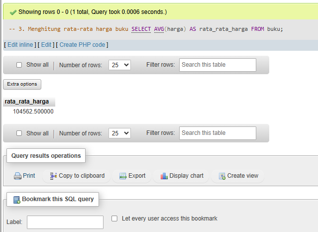

### 4. Buku Termahal
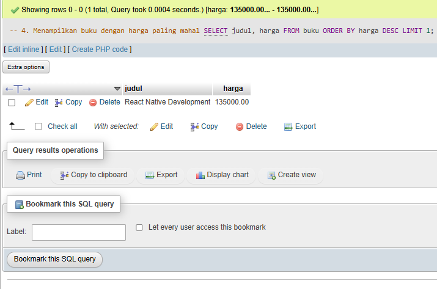

### 5. Stok Terbanyak
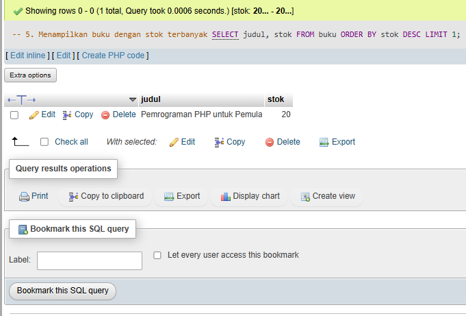

---

##  Filter dan Pencarian

### 1. Buku Pemrograman < 100.000
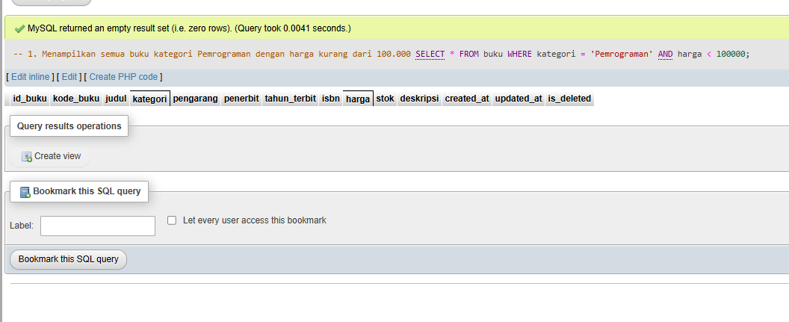

### 2. Judul mengandung PHP/MySQL
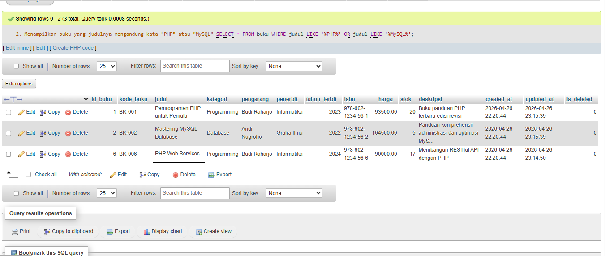

### 3. Buku Tahun 2024
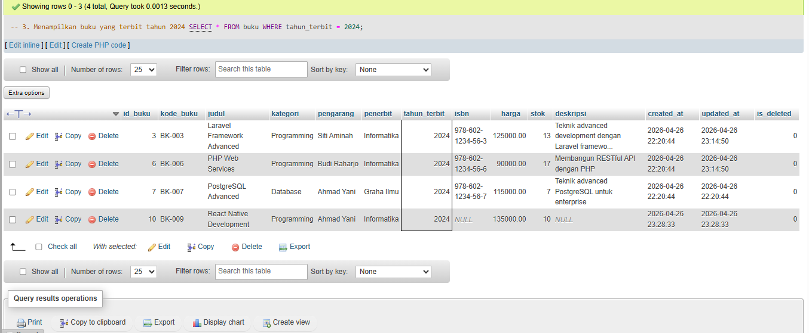

### 4. Stok antara 5-10
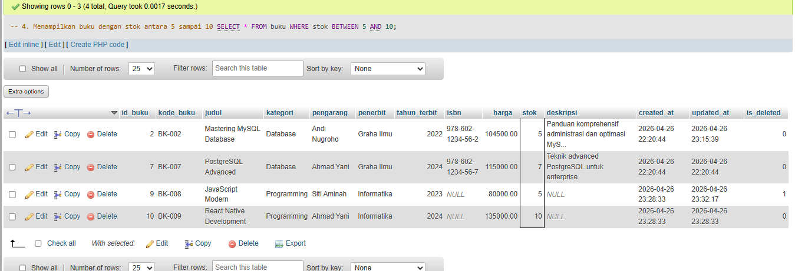

### 5. Pengarang Budi Raharjo
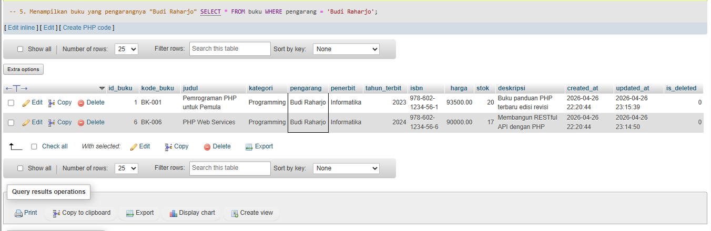

---

##  Grouping dan Agregasi

### 1. Jumlah Buku per Kategori
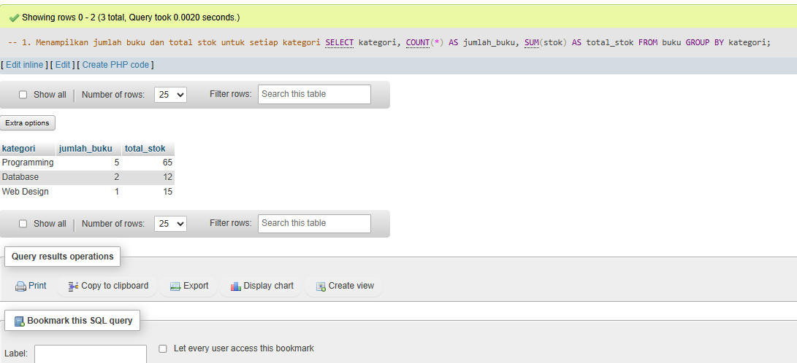

### 2. Rata-rata Harga per Kategori
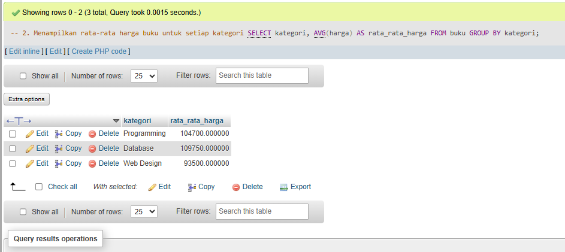

### 3. Kategori dengan Inventaris Terbesar
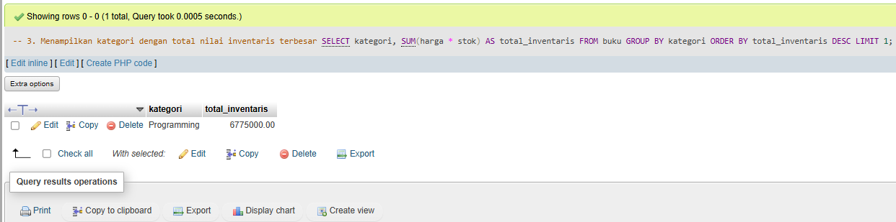

---

##  Update Data

### 1. Update Harga +5%
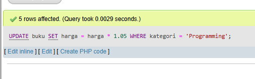

### 2. Update Stok < 5
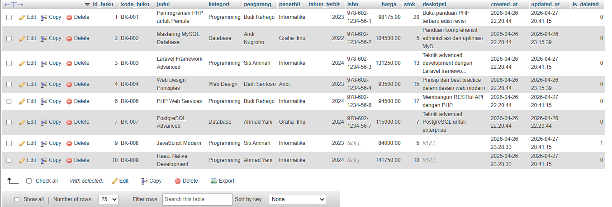

---

##  Laporan Khusus

### 1. Restocking (stok < 5)
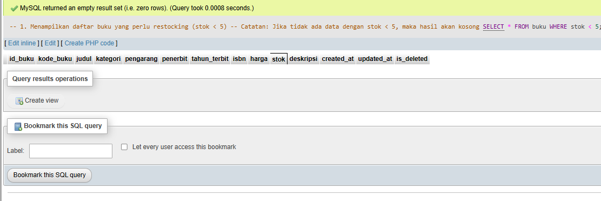

### 2. 5 Buku Termahal
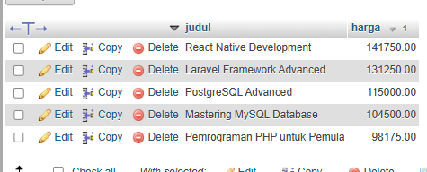
